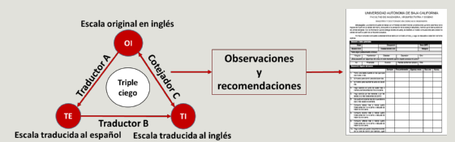

# Obtaining data from population


## Questionnaires

In order to obtain data that contribute with evidence, regarding of relations between Sleep Hygiene Factors (FSH) and the Quality of Sleep (QS), we selected two questionnaires clinically used. The Sleep Hygiene Index (SHI) and the Pitsburgh Sleep Quality Index (PSQI). As the population where the new questionnaire would be applied is Spanish-speaking and original questionnaires are in English language, we proceed to do the process of translation. The valid process to obtain a reliable translation consist of following stages: A person `A` translate the questionnaires from English to Spanish, a person `B` getback the spanish translation to the English language, and, a person `C`, compare the questionnaire obtained by the translation of the `B` person agains the original questionnaire. The `C` person, writes comments regarding of those itemes that do not match in meaning, corrections are done, and the process iterate until reach a satisfactory result (see  Fig. \@ref(fig:double-tr)).  

```{r double-tr, fig.cap='Double translation', out.width='80%', fig.asp=.75, fig.align='center', echo=FALSE}


```

After this translation, the two questionnaires where joined in a single questionnaire, adding a section in order to obtain demographic, emoptional and health data of relevance to this study. The new questionnaire was comformed by three sections. The first section has six demographic items, one emotional and one health item, the second section is the PSQI questionnaire that consists of 20 items, and, the third section is the SHI whit a total of 21 items. In the end, the SHI survey was left with 21 items, unlike the original that has 13, this has been, only for data granularity reasons, however, the changes do not alter the SHI objective. For example, item six of the original questionnaire that asked about the use of tobacco, alcohol, or caffeine, became three items to ask separately about the use of these three substances.

### Demographic emotional and health data

#### Demographic
In this section we ask about six relevant data that allow to understand the context of respondent. The six variables are age, gender, ocupation, kind of work, religion and civil status. Of this six variables, **kind of work** provide relevant information to the study, since the literature says that phisical activity improve the sleep quality [cita] . The options for this question are: *intellectual*, *phisical*, *more intellectual than phisical* and, *more phisical than intellectual*. The other variables in this section are for exploration purposes regarding of sleep quality and sleep hygiene.

#### Emotional
This variable asks to the respondent if he/she are in a crisis time. The crisis can be financial, mourning, divorce, or other that can significantly alter the quality of sleep. This answer is a target population filter for this study. Data from people in this circumstances are noisy to the study and should not be part of the data that will be used for the analysis.

#### Health
Similar than *Emotional* variable, the health variable asks if the respondent suffers from a chronic degenerative disease such as diabetes, hypertension, depression or another that can directly or indirectly alter the quality of sleep. Data from people suffering some disease are removed before the analysis.


### Quality of Sleep
The PSQI has been used to estimate the quality of sleep in clinical and nonclinical population [@mastin2006], and has been referred by numerous researchs in diverse sleep assessments [@bai2012]. This questionnaire evaluates the quality of sleep using nineteen items grouped in seven components: subjective sleep quality, sleep duration, sleep latency, sleep disturbances, use of sleep medication, day time disfunction and sleep latency. The questionnaire provide a baremo to score each component and sumarize the final score resulting in a dicotomic varaible; *\-good quality of sleep\-* or *\-poor quality of sleep\-* [@psqi1989]. For the purposes of this study, eighteen of the nineteen items was used in the second section, it fact does not affect the score results, since that latter item is not taken into account for the computation of the scale in the original questionnaire. On the other hand, the last item has to do with specific sleep disorders, for example, *\-sleep apnea\-*, while this study seeks to understand sleep habits in healthy people.


### Sleep Hygiene Index
It is an instrument designed to measure the sleep hygiene behavior in a nonclinical population. Its theoretical basis is in the criteria that International Classification of Sleep Disorders (ICSD) uses to diagnose an inadequate sleep hygiene. The scale has thirteen items and has reported an internal validity of  $\alpha=0.71$, as well a high reliability in test-retest evaluation[@mastin2006].

For the purposes of this study and based on what the literature reports regarding sleep hygiene factors, the following adjustments were made to the instrument, without interfering with its essence:

* Following the structure and the meaning of the item four *\- I exercise to the point of sweating within 1 h of going to bed\-*, two items were added: *\- I exercise to the point of sweating during the morning\-* and *\-I exercise to the point of sweating during the afternoon.\- *. The main purpose was to know whether the exercise in the morning or in the afternoon is directly correlated with sleep quality.[cita]

* Item six of the original questionnaire that asked about the use of tobacco, alcohol, or caffeine, became three items to ask separately about the use of these three substances.

* 
Esta es una prueba para test a ver quepasa con los branches
