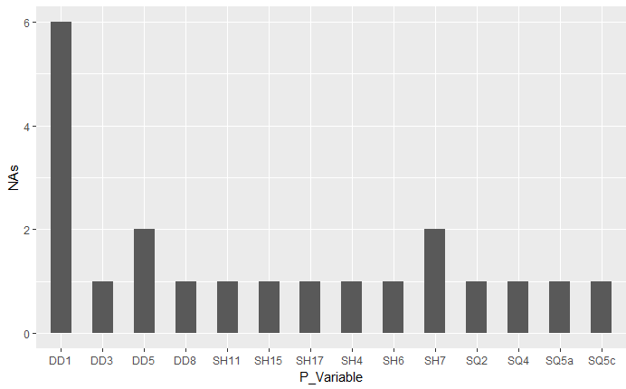

---
output:
  word_document: default
  html_document: default
---

```{r setup, include=FALSE}
#Es necesario poner encoding=utf8 para que los acentossean tratados como acentos

#Taking user info to establish the appropriate path to public functions
user<-Sys.info()[7]
user<-user[[1]]

#loading private functions

source(file="./code/preproceso.R",encoding = "UTF8")
source(file="./code/selecciona_muestra.R",encoding = "UTF8")
source(file="./code/elimina_faltantes.R",encoding = "UTF8")
source(file="./code/convierte_binaria.R",encoding = "UTF8")
source(file="./code/preproceso_1.R",encoding = "UTF8")
source(file="./code/baremo_PSQI.R",encoding = "UTF8")
source(file="./code/baremo_SHI.R",encoding = "UTF8")
source(file="./code/graba_recupera_archivo.R",encoding = "UTF8")
source(file="./code/preproceso.R",encoding = "UTF8")
source(file="./code/elige_sanos.R",encoding = "UTF8")
source(file="./code/elige_no_sanos.R",encoding = "UTF8")
source(file="./code/elige_no_anonimos.R",encoding = "UTF8")
source(file="./code/elige_anonimos.R",encoding = "UTF8")
source(file="./code/calcula_por_grupos.R",encoding = "UTF8")
source(file="./code/asigna_nombres.R",encoding = "UTF8")


#loading public functions
rutaPublicFunctions<-paste("C:/Users/",user,"/Google Drive/R-util-functions/",sep = "") 
source(file=paste(rutaPublicFunctions,"QOfCategoricalF.R",sep = ""),encoding = "UTF8")
source(file=paste(rutaPublicFunctions,"QOfContinuousF.R",sep = ""),encoding = "UTF8")


#loading libraries
library(ggplot2)
library(DT)


knitr::opts_chunk$set(echo = FALSE)
```

# Data preparation
This pre-process of refinenment of data has the goal of generate a set of quality data. For this work, it is based in [@Kelleher2015]. The resulting dataset will allow runs the algorithms to select the relevant features to generate the model. Three aspects are considered for the pre-process:  missing values, cardinality and outliers. Using the right metrics, it is possible to take a decision of columns and records that must remain in the dataset as relevant information, as well as data that must be removed.

Begining with the analysis, two tables were elaborated to observe the quality of the data. One for continuos variables and a second for discrete variables. For space reasons and better visualization, the variables were divided in subgroups.


## Missing values
```{r elimina-faltantes}
ruta<-paste("C:/Users/",user,"/Google Drive/Doctorado/Tesis/Data/",sep = "") 
  d_crudos<-read.csv(file=paste(ruta,"responses.csv",sep = ""),header = T,sep = ",")
  
  dt<-d_crudos[-1]
  dt[,1]<-as.character(dt[,1])
  dt[dt[,1]=='',1]<-'anonimo'
  
  #asigna NA a los campos vacios excepto en el primer campo que es el email.
  #este campo es opcional por lo tanto en muchos registros no estara.
  dt[dt=='']<-NA
  
  dt<-asigna_nombres(dt)
  dt<-dt[-1]
  
  write.csv(dt,file = paste(ruta,"respNA.csv",sep = ""))
  
  #se utiliza el paquete amelia para generar el mapa de datos faltantes
  #AmeliaView()
  
  #Selecciona datos faltantes y los guarda en un archivo
  dtna<-dt[!complete.cases(dt),]
  dtna<-dtna[-1]
  write.csv(dt,file = paste(ruta,"respNA.csv",sep = ""))
  
```

In a preliminar revision of the data, 3 records was eliminated due the absence of data in each of its columns. In the next step, the Amelia package [@Amelia2011] was used to examine the missing values. The Figure \@ref(missing-map) shows a map of missing values, in the horizontal axis are the names of predictive variables, while the vertical axis is the number of record that contains the missing values, represented by beige color. 

```{r missing-map, fig.cap='Map of missing values in the dataset', out.width='50%', fig.asp=.75, fig.align='center'}
knitr::include_graphics("images/mapOfMissingValues.png")

```

This twenty records contains 21 missing values distributed in 14 variables (see Fig. \@ref(NumberOfNAsBar)). As the missing values are not concentrated in a single variable and the total of records with missing values is not significant for the data set, we proceeded to delete the missing records. We did not choose to use imputation techniques, because there are no studies that show trends in the data.

```{r cuenta_de_NAs}
dtna<-dtna[-c(16,17,21),]

countofna<-data.frame(NAs=apply(dtna,2,FUN = function(x) length(x[is.na(x)])))

xmaycero<-apply(countofna,2,FUN = function(x) x[x>0])

xmaycero<-data.frame(P_Variable=row.names(xmaycero),xmaycero)

#gb<-ggplot(data=xmaycero,aes(P_Variable,NAs))+geom_col(width = 0.5,aes(fill=NAs))
gb<-ggplot(data=xmaycero,aes(P_Variable,NAs))+geom_col(width = 0.5)
```


```{r NumberOfNAsBar, fig.cap='Number of Missing Values per Variable', out.width='50%', fig.asp=.75, fig.align='center', echo=FALSE}


```

## Irregular Cardinality
```{r cleaning-data}
d_preproc<-preproceso(d_crudos,"2_clases")

dtContinuous<-cbind.data.frame(DD1=d_preproc$DD1,d_preproc[,10:13],DD1=d_preproc$SQTT,d_preproc[,58:62])  
dtCategoricalDEM<-d_preproc[,3:9]
dtCategoricalSQ<-cbind.data.frame(d_preproc[,14:27],SQCL=d_preproc$SQCL)
dtCategoricalSH<-d_preproc[,28:48]  


QTCATDEM<-QOfCategoricalF(dtCategoricalDEM)
datatable(QTCATDEM)

```


## Outliers

# Bibliography