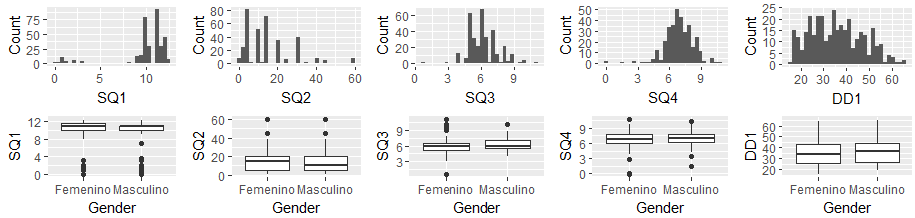

---
output:
  pdf_document: default
  html_document: default
  word_document: default
---

# Data pre-process

```{r setup,, echo=FALSE}
library(ggplot2)
library(bitops)
library(RCurl)


#Funciones locales
source(file="C:/Master/apuntes-articulo-feature-selection/code/preproceso_1.R",encoding = "UTF8")
source(file="C:/Master/apuntes-articulo-feature-selection/code/baremo_PSQI.R",encoding = "UTF8")
source(file="C:/Master/apuntes-articulo-feature-selection/code/baremo_SHI.R",encoding = "UTF8")


#funciones online
script <- getURL("https://raw.githubusercontent.com/arturo-laflor/util-R-codes/master/QOfCategoricalF.R", ssl.verifypeer = FALSE)
eval(parse(text = script),envir=.GlobalEnv)

script <- getURL("https://raw.githubusercontent.com/arturo-laflor/util-R-codes/master/QOfContinuousF.R", ssl.verifypeer = FALSE)
eval(parse(text = script),envir=.GlobalEnv)

script <- getURL("https://raw.githubusercontent.com/arturo-laflor/util-R-codes/master/multiplot.R", ssl.verifypeer = FALSE)
eval(parse(text = script),envir=.GlobalEnv)

knitr::opts_chunk$set(echo = FALSE,root.dir="C:/Master/apuntes-articulo-feature-selection/",fig.pos = 'H')

#setwd("C:/Master/apuntes-articulo-feature-selection/")
```


## Estructuration and validation data process

Before to generate the quality report of the data, the data are loaded and passed for a process of validation and restructuration. This process includes the renaming of the columns and data validation for columns containing information of time and age. Additionally, the values for the responses of SHI and PSQI questionnaires was recodified from original responses ('Nunca','Casi nunca','Algunas veces','Frecuentemente','Siempre') to data that can be used to numerical and algorithmical analysis ('0','1','2','3','4').

```{r lee_dataset__con_scripts_originales, echo=FALSE}
user<-Sys.info()[7]
user<-user[[1]]
ruta<-paste("C:/Users/",user,"/Google Drive/Doctorado/Tesis/Data/",sep = "") 
  d_resp_Bad_script<-read.csv(file=paste(ruta,"responses_after_preproc_1.1.csv",sep = ""),header = T,sep = ",")

d_resp_Bad_script<-d_resp_Bad_script[-1]
  
#write.csv(file=paste(ruta,"responses_after_preproc_1.1.csv",sep = ""),QS_data)


```

The resulting dataset has `r dim(d_resp_Bad_script)[2]` columns, distributed as the \@ref(tab:distribution-of-features-by-type) shows:

\begin{table}[ht]
\centering
\caption{Distribution of features in the dataset by type}
\label{tab:distribution-of-features-by-type}
\begin{tabular}{|l|c|l|}
\hline
\multicolumn{1}{|c|}{\textbf{Type}} & \textbf{Quantity} & \multicolumn{1}{c|}{\textbf{Columns in the dataset}} \\ \hline
CharID                              & 1                 & 1                                                    \\ \hline
Categorical                         & 41                & {[}3-9{]} and {[}14-48{]}                            \\ \hline
Continuous                          & 6                 & 2 and {[}10-13{]}                                    \\ \hline
\end{tabular}
\end{table}


The quality analysis of data was based in the recommendations of [@Kelleher2015]. The resulting dataset will allow runs the algorithms to select the relevant features to generate the model. The analysis of the data quality includes the treadment of missing values, outliers and cardinality as well as correction of some possible bugs in the scripts that do the process of restructuration and validation of the dataset. The data quality analysis begins with a report of quality of continouos and categorical features. For continuous variables ten metrics were analyzed: quantity, missing values, cardinality, minimum value, first quartile, median, third quartile, maximum value, mean, and standard deviation. For categorical variables, nine metrics were analyzed: quantity, missing values, cardinality, mode, mode frequency, mode percent, second mode, second mode frequency and second mode percent. Before to do this report, a look at the complete dataset allowed to identify three records that contains no data for any feature. These records were deleted to avoid noisy information in the quality analysis.


## Data quality report

The data quality report was performed using two scripts, one for continuous and one for categorical features, so, the features were grouped by type to do the analysis.  

### Continuous features
The dataset contains five continuous features, one for demographic data (DD1=AGE) and four features that measure the sleep duration (SQ1="Time to go to bed", SQ2="Latency of sleep", SQ3="Time to wake up", SQ4="Period of time between going to bed and waking up").

```{r report-of-quality-contfeat-bad-script}
dfCONTFEAT<-cbind.data.frame(DD1=d_resp_Bad_script[,2],d_resp_Bad_script[,10:13])
DRCONT<-QOfContinuousF(dfCONTFEAT)

```

\begin{table}[ht]
\centering
\caption{Data quality report of continuous features}
\label{tab:data-quality-report-of-continuous-features}
\begin{tabular}{llllllllll}
\hline
\multicolumn{1}{c}{\textbf{Feature}} & \multicolumn{1}{c}{\textbf{Count}} & \multicolumn{1}{c}{\textbf{Miss}} & \multicolumn{1}{c}{\textbf{Card}} & \multicolumn{1}{c}{\textbf{Min}} & \multicolumn{1}{c}{\textbf{Qrt1}} & \multicolumn{1}{c}{\textbf{Median}} & \multicolumn{1}{c}{\textbf{Qrt3}} & \multicolumn{1}{c}{\textbf{Max}} & \multicolumn{1}{c}{\textbf{Mean}} \\ \hline
DD1                                  & 338                                & 6                                 & 49                                & 16                               & 27                                & 35                                  & 44                                & 66                               & 35.92                             \\
SQ1                                  & 338                                & 0                                 & 29                                & 0                                & 10                                & 11                                  & 11.08                             & 12.5                             & 9.99                              \\
SQ2                                  & 338                                & 1                                 & 15                                & 1                                & 5                                 & 15                                  & 20                                & 60                               & 14.99                             \\
SQ3                                  & 338                                & 2                                 & 40                                & 0.7                              & 5.08                              & 6                                   & 7                                 & 11                               & 6.18                              \\
SQ4                                  & 338                                & 3                                 & 107                               & -0.05                            & 6.17                              & \multicolumn{1}{c}{6.88}            & 7.75                              & 10.75                            & 6.91                              \\ \hline
\end{tabular}
\end{table}


The table \@ref(tab:data-quality-report-of-continuous-features) shows some irregularities in continuous variables, as we can see, a negative value is the minimum value in the SQ4 variable; this variable represents the *Period of time between going to bed and waking up*, thus no negative value must be enter in this field, likewise, it appear a $0.0$ value as the minimun value in the SQ1 variable, which is wrong because this is the time that respondents said go to bed, and, in this case, $0.00$ is not a valid answer, in any case, an appropriate answer would be $12.00$, referring to midnight. On the other hand, the variable SQ2, has a large standard deviation ($\sigma=11.91$), since the variable represents the minutes that person takes to fall asleep in minutes ($\mu\simeq 15$). 

No one of these features have a great quantity of missing values, DD1 is the variable with most of them, however the missing values represents only the $`r round(max(DRCONT[,2])/dim(d_resp_Bad_script)[1],digits=3)` \%$ of the data, whis is not significant. If we assume that each record that contains a missing value is a different row, we have $`r sum(DRCONT[,2])`$ records, which represents the 
$`r round(sum(DRCONT[,2])/dim(d_resp_Bad_script)[1],digits=3)`\%$. As this percentage is small, and there are not in our hands, previous works describing the tendency of the data, these records with missing values could be deleted. 

These continuos variables shows good cardinality, even though the ratio between the cardinality and number of records is not close to one. The nature of the data justifies this fact, because although the features are continuous and in theory they could take a large number of values, they take a small range of values, for instance, the variable SQ1 take an small range of values because the people answer commonly to this kind of question with onclock time, it means, people ask that they go to bed at $9:00$, $10:30$, $10:45$ or $11:00$, even when they, actually were to bed at $9:03$, or $10:33$ referring to the first to examples. The other variables have similar nature, thus the conclusion that cardinality is good for this variables, where the smallest cardinality was 15.

Additionaly to previous analysis, histograms and boxplot were generated to observe the behaviour of the data. 

```{r hb-of-cf, fig.cap='Histogramas and Boxplots of the continuous features', out.width='90%', fig.asp=0.75, fig.align='center', echo=FALSE,results=FALSE}


```


```{r histograms-bocplots, echo=FALSE,message=FALSE,warning=FALSE,results=FALSE}
# library(ggplot2)
# 
# histDD1<-ggplot(data=d_resp_Bad_script,aes(DD1))+geom_histogram(bins = 30)+labs(y="Count")
# histSQ1<-ggplot(data=d_resp_Bad_script,aes(SQ1))+geom_histogram(bins = 30)+labs(y="Count")
# histSQ2<-ggplot(data=d_resp_Bad_script,aes(SQ2))+geom_histogram(bins = 30)+labs(y="Count")
# histSQ3<-ggplot(data=d_resp_Bad_script,aes(SQ3))+geom_histogram(bins = 30)+labs(y="Count")
# histSQ4<-ggplot(data=d_resp_Bad_script,aes(SQ4))+geom_histogram(bins = 30)+labs(y="Count")
# 
# boxplotDD1<-ggplot(data=d_resp_Bad_script, aes(as.factor(DD2),DD1))+geom_boxplot()+labs(x="Gender")
# boxplotSQ1<-ggplot(data=d_resp_Bad_script, aes(as.factor(DD2),SQ1))+geom_boxplot()+labs(x="Gender")
# boxplotSQ2<-ggplot(data=d_resp_Bad_script, aes(as.factor(DD2),SQ2))+geom_boxplot()+labs(x="Gender")
# boxplotSQ3<-ggplot(data=d_resp_Bad_script, aes(as.factor(DD2),SQ3))+geom_boxplot()+labs(x="Gender")
# boxplotSQ4<-ggplot(data=d_resp_Bad_script, aes(as.factor(DD2),SQ4))+geom_boxplot()+labs(x="Gender")
# 
# 
# multiplot(histDD1,histSQ1,histSQ2,histSQ3,histSQ4,boxplotDD1,boxplotSQ1,boxplotSQ2,boxplotSQ3,boxplotSQ4,cols=2)
```

The plots in the Fig. \@ref(fig:hb-of-cf) shows that the continuous features have outliers which should be analyzed to include/exclude from de dataset before of the training of the model to obtain better results. These variables do not intervene directly in the generation of the model, the model is generated from the SH features, however, these outliers could be indicators of some disorder of sleep in the respondent, thus the analysis must be performed.

The Table \@ref(tab-data-quality-plan-continuous) summarizes the data quality issues in continuous features and the potential strategies to attend them.

\begin{table}[ht]
\centering
\caption{Data quality plan for continuous features}
\label{tab-data-quality-plan-continuous}
\begin{tabular}{|l|p{5cm}|p{8cm}|}
\hline
Feature & Data quality issue  & Strategie \\ \hline
SQ1     & Data contain 0.0, the correct value should be 12.00 & Refine the process of convert data for this field  \\ \hline
SQ4     & Data contain negative values, it is wrong because the data represents the time to wake up & Refine the process validating the data, to correct the problem, or, eliminate the records with this issue. \\ \hline
SQ2     & Standar deviation too large & Finding outliers visually and analytically. Excluding outliers from the modeling may improve the predictions. These analysis of outliers includes all continuous variables.  \\ \hline
All     & Missing values  & The percentage of missing values is low, it allows to eliminate records with missing values. The decision of impute data is a few probable, since no reports are in our bibliography to know the tendency of the data. \\ \hline
\end{tabular}
\end{table}

## Categorical Features for demographics data

The categorical features were divided in two groups, the demographic features are in the first group and the features containing all the information over the sleep hygiene are in other group.

```{r report-of-quality-catdemofeat-bad-script}
DRCATDEMO<-QOfCategoricalF(cbind.data.frame(d_resp_Bad_script[,3:9]))

```

\begin{table}[ht]
\centering
\caption{Data quality report of continuous features}
\label{Report-of-quality-of-the-categorical-demographic-features}
\begin{tabular}{llllp{2cm}llp{2cm}ll}
\hline
\textbf{Feat.} & \textbf{Count} & \textbf{Miss} & \textbf{Card} & \textbf{Mode}         & \textbf{MF} & \textbf{M\%} & \textbf{Mode2} & \textbf{M2F} & \textbf{M2\%} \\ \hline
DD2              & 338            & 0             & 2             & Femenino              & 188               & 55.62\%           & Masculino      & 150                & 44.38\%            \\
DD3              & 338            & 1             & 5             & Docente               & 143               & 42.31\%           & Empleado       & 70                 & 20.71\%            \\
DD4              & 338            & 0             & 4             & Más mental que físico & 156               & 46.15\%           & Mental         & 143                & 42.31\%            \\
DD5              & 338            & 2             & 5             & ASD                   & 150               & 44.38\%           & Católica       & 129                & 38.17\%            \\
DD6              & 338            & 0             & 1             & Unión Libre           & 338               & 100\%             & NA             & NA                 & NA\%               \\
DD7              & 338            & 0             & 5             & Ninguno               & 284               & 84.02\%           & Otro           & 26                 & 7.69\%             \\
DD8              & 338            & 1             & 5             & No                    & 272               & 80.47\%           & Otra           & 34                 & 10.06\%            \\ \hline
\end{tabular}
\end{table}


The table \@ref(Report-of-quality-of-the-categorical-demographic-features) shows only one irregularity in this set of variables, the variable DD6 has the hihest mode posible ($100\%$), if data are right, all respondents are living in free union status  which is very doubtful taken in account the population were the questionnaire was applied. There are less missing values than in the continuous features, so, it is possible to think in eliminate the records. The cardinality is not a problem in this set of features (except for the variable DD6 as commented above), since all posibilities have representation. In the two cases (features DD7 and DD8) where the mode capture a high percentage of the data, the information is good for this research. DD7 refers to people who suffer some chronic disease, the best answer to this work is "Any" because the intention is to work with healthy people, likewise in the DD8 variable that ask to the people if they are in some crisis that disrups their sleep, the best answer to this work is "No", fortunatelly, this is the mode.


