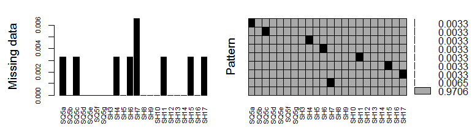

---
output:
  pdf_document: default
  html_document: default
  word_document: default
---

# Data pre-process

```{r setup,, echo=FALSE}
library(ggplot2)
library(bitops)
library(RCurl)


#Funciones locales
source(file="C:/Master/apuntes-articulo-feature-selection/code/preproceso_1.R",encoding = "UTF8")
source(file="C:/Master/apuntes-articulo-feature-selection/code/baremo_PSQI.R",encoding = "UTF8")
source(file="C:/Master/apuntes-articulo-feature-selection/code/baremo_SHI.R",encoding = "UTF8")


#funciones online
script <- getURL("https://raw.githubusercontent.com/arturo-laflor/util-R-codes/master/QOfCategoricalF.R", ssl.verifypeer = FALSE)
eval(parse(text = script),envir=.GlobalEnv)

script <- getURL("https://raw.githubusercontent.com/arturo-laflor/util-R-codes/master/QOfContinuousF.R", ssl.verifypeer = FALSE)
eval(parse(text = script),envir=.GlobalEnv)

script <- getURL("https://raw.githubusercontent.com/arturo-laflor/util-R-codes/master/multiplot.R", ssl.verifypeer = FALSE)
eval(parse(text = script),envir=.GlobalEnv)

knitr::opts_chunk$set(echo = FALSE,root.dir="C:/Master/apuntes-articulo-feature-selection/",fig.pos = 'H')

#setwd("C:/Master/apuntes-articulo-feature-selection/")
```


## Estructuration and validation data process

Before to generate the quality report of the data, the data are loaded and passed for a process of validation and restructuration. This process includes the renaming of the columns and data validation for columns containing information of time and age. Additionally, the values for the responses of SHI and PSQI questionnaires was recodified from original responses ('Nunca','Casi nunca','Algunas veces','Frecuentemente','Siempre') to data that can be used to numerical and algorithmical analysis ('0','1','2','3','4').

```{r lee_dataset__con_scripts_originales, echo=FALSE}
user<-Sys.info()[7]
user<-user[[1]]
ruta<-paste("C:/Users/",user,"/Google Drive/Doctorado/Tesis/Data/",sep = "") 
  d_resp_Bad_script<-read.csv(file=paste(ruta,"responses_after_preproc_1.1.csv",sep = ""),header = T,sep = ",")

d_resp_Bad_script<-d_resp_Bad_script[-1]
  
#write.csv(file=paste(ruta,"responses_after_preproc_1.1.csv",sep = ""),QS_data)


```

The resulting dataset has `r dim(d_resp_Bad_script)[2]` columns, distributed as the \@ref(tab:distribution-of-features-by-type) shows:

\begin{table}[ht]
\centering
\caption{Distribution of features in the dataset by type}
\label{tab:distribution-of-features-by-type}
\begin{tabular}{|l|c|l|}
\hline
\multicolumn{1}{|c|}{\textbf{Type}} & \textbf{Quantity} & \multicolumn{1}{c|}{\textbf{Columns in the dataset}} \\ \hline
CharID                              & 1                 & 1                                                    \\ \hline
Categorical                         & 41                & {[}3-9{]} and {[}14-48{]}                            \\ \hline
Continuous                          & 6                 & 2 and {[}10-13{]}                                    \\ \hline
\end{tabular}
\end{table}


The quality analysis of data was based in the recommendations of [@Kelleher2015]. The resulting dataset will allow runs the algorithms to select the relevant features to generate the model. The analysis of the data quality includes the treadment of missing values, outliers and cardinality as well as correction of some possible bugs in the scripts that do the process of restructuration and validation of the dataset. The data quality analysis begins with a report of quality of continouos and categorical features. For continuous variables ten metrics were analyzed: quantity, missing values, cardinality, minimum value, first quartile, median, third quartile, maximum value, mean, and standard deviation. For categorical variables, nine metrics were analyzed: quantity, missing values, cardinality, mode, mode frequency, mode percent, second mode, second mode frequency and second mode percent. Before to do this report, a look at the complete dataset allowed to identify three records that contains no data for any feature. These records were deleted to avoid noisy information in the quality analysis.


## Data quality report

The data quality report was performed using two scripts, one for continuous and one for categorical features, so, the features were grouped by type to do the analysis.  

### Continuous features
The dataset contains five continuous features, one for demographic data (DD1=AGE) and four features that measure the sleep duration (SQ1="Time to go to bed", SQ2="Latency of sleep", SQ3="Time to wake up", SQ4="Period of time between going to bed and waking up").

```{r report-of-quality-contfeat-bad-script}
dfCONTFEAT<-cbind.data.frame(DD1=d_resp_Bad_script[,2],d_resp_Bad_script[,10:13])
DRCONT<-QOfContinuousF(dfCONTFEAT)

```

\begin{table}[ht]
\centering
\caption{Data quality report of continuous features}
\label{tab:data-quality-report-of-continuous-features}
\begin{tabular}{llllllllll}
\hline
\multicolumn{1}{c}{\textbf{Feature}} & \multicolumn{1}{c}{\textbf{Count}} & \multicolumn{1}{c}{\textbf{Miss}} & \multicolumn{1}{c}{\textbf{Card}} & \multicolumn{1}{c}{\textbf{Min}} & \multicolumn{1}{c}{\textbf{Qrt1}} & \multicolumn{1}{c}{\textbf{Median}} & \multicolumn{1}{c}{\textbf{Qrt3}} & \multicolumn{1}{c}{\textbf{Max}} & \multicolumn{1}{c}{\textbf{Mean}} \\ \hline
DD1   & 338  & 6  & 49  & 16    & 27     & 35    & 44      & 66    & 35.92          \\
SQ1   & 338  & 0  & 29  & 0     & 10     & 11    & 11.08   & 12.5  & 9.99           \\
SQ2   & 338  & 1  & 15  & 1     & 5      & 15    & 20      & 60    & 14.99          \\
SQ3   & 338  & 2  & 40  & 0.7   & 5.08   & 6     & 7       & 11    & 6.18           \\
SQ4   & 338  & 3  & 107 & -0.05 & 6.17   & 6.88  & 7.75    & 10.75 & 6.91           \\ 
\hline
\end{tabular}
\end{table}


The table \@ref(tab:data-quality-report-of-continuous-features) shows some irregularities in continuous variables, as we can see, a negative value is the minimum value in the SQ4 variable; this variable represents the *Period of time between going to bed and waking up*, thus no negative value must be enter in this field, likewise, it appear a $0.0$ value as the minimun value in the SQ1 variable, which is wrong because this is the time that respondents said go to bed, and, in this case, $0.00$ is not a valid answer, in any case, an appropriate answer would be $12.00$, referring to midnight. On the other hand, the variable SQ2, has a large standard deviation ($\sigma=11.91$), since the variable represents the minutes that person takes to fall asleep in minutes ($\mu\simeq 15$). 

No one of these features have a great quantity of missing values, DD1 is the variable with most of them, however the missing values represents only the $`r round(max(DRCONT[,2])/dim(d_resp_Bad_script)[1],digits=3)` \%$ of the data, whis is not significant. If we assume that each record that contains a missing value is a different row, we have $`r sum(DRCONT[,2])`$ records, which represents the 
$`r round(sum(DRCONT[,2])/dim(d_resp_Bad_script)[1],digits=3)`\%$. As this percentage is small, and there are not in our hands, previous works describing the tendency of the data, these records with missing values could be deleted. 

These continuos variables shows good cardinality, even though the ratio between the cardinality and number of records is not close to one. The nature of the data justifies this fact, because although the features are continuous and in theory they could take a large number of values, they take a small range of values, for instance, the variable SQ1 take an small range of values because the people answer commonly to this kind of question with onclock time, it means, people ask that they go to bed at $9:00$, $10:30$, $10:45$ or $11:00$, even when they, actually were to bed at $9:03$, or $10:33$ referring to the first to examples. The other variables have similar nature, thus the conclusion that cardinality is good for this variables, where the smallest cardinality was 15.

Additionaly to previous analysis, histograms and boxplot were generated to observe the behaviour of the data. 

```{r hb-of-cf, fig.cap='Histograms and boxplots of the continuous features', out.width='90%', fig.asp=0.75, fig.align='center', echo=FALSE,results=FALSE}
knitr::include_graphics("images/hist-boxplots-continuous-variables.png")

```


```{r histograms-bocplots, echo=FALSE,message=FALSE,warning=FALSE,results=FALSE}
# library(ggplot2)
# 
# histDD1<-ggplot(data=d_resp_Bad_script,aes(DD1))+geom_histogram(bins = 30)+labs(y="Count")
# histSQ1<-ggplot(data=d_resp_Bad_script,aes(SQ1))+geom_histogram(bins = 30)+labs(y="Count")
# histSQ2<-ggplot(data=d_resp_Bad_script,aes(SQ2))+geom_histogram(bins = 30)+labs(y="Count")
# histSQ3<-ggplot(data=d_resp_Bad_script,aes(SQ3))+geom_histogram(bins = 30)+labs(y="Count")
# histSQ4<-ggplot(data=d_resp_Bad_script,aes(SQ4))+geom_histogram(bins = 30)+labs(y="Count")
# 
# boxplotDD1<-ggplot(data=d_resp_Bad_script, aes(as.factor(DD2),DD1))+geom_boxplot()+labs(x="Gender")
# boxplotSQ1<-ggplot(data=d_resp_Bad_script, aes(as.factor(DD2),SQ1))+geom_boxplot()+labs(x="Gender")
# boxplotSQ2<-ggplot(data=d_resp_Bad_script, aes(as.factor(DD2),SQ2))+geom_boxplot()+labs(x="Gender")
# boxplotSQ3<-ggplot(data=d_resp_Bad_script, aes(as.factor(DD2),SQ3))+geom_boxplot()+labs(x="Gender")
# boxplotSQ4<-ggplot(data=d_resp_Bad_script, aes(as.factor(DD2),SQ4))+geom_boxplot()+labs(x="Gender")
# 
# 
# multiplot(histDD1,histSQ1,histSQ2,histSQ3,histSQ4,boxplotDD1,boxplotSQ1,boxplotSQ2,boxplotSQ3,boxplotSQ4,cols=2)
```

The plots in the Fig. \@ref(fig:hb-of-cf) shows that the continuous features have outliers which should be analyzed to include/exclude from de dataset before of the training of the model to obtain better results. These variables do not intervene directly in the generation of the model, the model is generated from the SH features, however, these outliers could be indicators of some disorder of sleep in the respondent, thus the analysis must be performed.

The Table \@ref(tab-data-quality-plan-continuous) summarizes the data quality issues in continuous features and the potential strategies to attend them.

\begin{table}[ht]
\centering
\caption{Data quality plan for continuous features}
\label{tab-data-quality-plan-continuous}
\begin{tabular}{|l|p{5cm}|p{8cm}|}
\hline
Feature & Data quality issue  & Strategie \\ \hline
SQ1     & Data contain 0.0, the correct value should be 12.00 & Refine the process of convert data for this field  \\ \hline
SQ4     & Data contain negative values, it is wrong because the data represents the time to wake up & Refine the process validating the data, to correct the problem, or, eliminate the records with this issue. \\ \hline
SQ2     & Standar deviation too large & Finding outliers visually and analytically. Excluding outliers from the modeling may improve the predictions. These analysis of outliers includes all continuous variables.  \\ \hline
All     & Missing values  & The percentage of missing values is low, it allows to eliminate records with missing values. The decision of impute data is a few probable, since no reports are in our bibliography to know the tendency of the data. \\ \hline
\end{tabular}
\end{table}

## Categorical Features for demographics data

The categorical features were divided in two groups, the demographic features are in the first group and the features containing all the information over the sleep hygiene are in other group.

```{r report-of-quality-catdemofeat-bad-script}
DRCATDEMO<-QOfCategoricalF(cbind.data.frame(d_resp_Bad_script[,3:9]))

```

\begin{table}[ht]
\centering
\caption{Data quality report of continuous features}
\label{Report-of-quality-of-the-categorical-demographic-features}
\begin{tabular}{llllp{2cm}llp{2cm}ll}
\hline
\textbf{Feat.} & \textbf{Count} & \textbf{Miss} & \textbf{Card} & \textbf{Mode}         & \textbf{MF} & \textbf{M\%} & \textbf{Mode2} & \textbf{M2F} & \textbf{M2\%} \\ \hline
DD2              & 338            & 0             & 2             & Femenino              & 188               & 55.62\%           & Masculino      & 150                & 44.38\%            \\
DD3              & 338            & 1             & 5             & Docente               & 143               & 42.31\%           & Empleado       & 70                 & 20.71\%            \\
DD4              & 338            & 0             & 4             & Más mental que físico & 156               & 46.15\%           & Mental         & 143                & 42.31\%            \\
DD5              & 338            & 2             & 5             & ASD                   & 150               & 44.38\%           & Católica       & 129                & 38.17\%            \\
DD6              & 338            & 0             & 1             & Unión Libre           & 338               & 100\%             & NA             & NA                 & NA\%               \\
DD7              & 338            & 0             & 5             & Ninguno               & 284               & 84.02\%           & Otro           & 26                 & 7.69\%             \\
DD8              & 338            & 1             & 5             & No                    & 272               & 80.47\%           & Otra           & 34                 & 10.06\%            \\ \hline
\end{tabular}
\end{table}


The table \@ref(Report-of-quality-of-the-categorical-demographic-features) shows only one irregularity in this set of variables, the variable DD6 has the hihest mode posible ($100\%$), if data are right, all respondents are living in free union status  which is very doubtful taken in account the population were the questionnaire was applied. There are less missing values than in the continuous features, so, it is possible to think in eliminate the records. The cardinality is not a problem in this set of features (except for the variable DD6 as commented above), since all posibilities have representation. In the two cases (features DD7 and DD8) where the mode capture a high percentage of the data, the information is good for this research. DD7 refers to people who suffer some chronic disease, the best answer to this work is "Any" because the intention is to work with healthy people, likewise in the DD8 variable that ask to the people if they are in some crisis that disrups their sleep, the best answer to this work is "No", fortunatelly, this is the mode.


### Categorical features for Slepp hygiene

```{r report-of-quality-catshfeat}
DRCATSH<-QOfCategoricalF(cbind.data.frame(d_resp_Bad_script[,28:48]))

write.csv(DRCATSH,file = paste(ruta,"quality-reposrt-raw-SH.csv",sep = ""))
```

\begin{table}[ht]
\centering
\caption{Report of quality of the SH features}
\label{tab:report-of-quality-of-the-sleep-hygiene-features}
\begin{tabular}{llllllllll}
\hline
\multicolumn{1}{c}{\textbf{Feature}} & \multicolumn{1}{c}{\textbf{Count}} & \multicolumn{1}{c}{\textbf{Miss}} & \multicolumn{1}{c}{\textbf{Card}} & \multicolumn{1}{c}{\textbf{Mode}} & \multicolumn{1}{c}{\textbf{MF}} & \multicolumn{1}{c}{\textbf{M\%}} & \multicolumn{1}{c}{\textbf{Mode2}} & \multicolumn{1}{c}{\textbf{M2F}} & \multicolumn{1}{c}{\textbf{M2\%}} \\
\hline
SH1    & 338    & 0   & 5  & 1     & 114   & 33.73\%   & 0   & 111  & 32.84\%  \\
SH4    & 338    & 1   & 5  & 0     & 204   & 60.36\%   & 1   & 67   & 19.82\%  \\
SH5    & 338    & 0   & 5  & 0     & 176   & 52.07\%   & 2   & 64   & 18.93\%  \\
SH6    & 338    & 1   & 5  & 0     & 152   & 44.97\%   & 1   & 75   & 22.19\%  \\
SH7    & 338    & 2   & 5  & 0     & 142   & 42.01\%   & 1   & 107  & 31.66\%  \\
SH8    & 338    & 0   & 5  & 0     & 319   & 94.38\%   & 4   & 7    & 2.07\%   \\
SH9    & 338    & 0   & 4  & 0     & 276   & 81.66\%   & 1   & 34   & 10.06\%  \\
SH10   & 338    & 0   & 5  & 0     & 223   & 65.98\%   & 1   & 57   & 16.86\%  \\
SH11   & 338    & 1   & 5  & 0     & 104   & 30.77\%   & 2   & 78   & 23.08\%  \\
SH12   & 338    & 0   & 5  & 1     & 133   & 39.35\%   & 2   & 114  & 33.73\%  \\
SH13   & 338    & 0   & 5  & 2     & 92    & 27.22\%   & 1   & 76   & 22.49\%  \\
SH14   & 338    & 0   & 5  & 0     & 210   & 62.13\%   & 1   & 61   & 18.05\%  \\
SH15   & 338    & 1   & 5  & 0     & 101   & 29.88\%   & 1   & 91   & 26.92\%  \\
SH16   & 338    & 0   & 5  & 0     & 163   & 48.22\%   & 1   & 84   & 24.85\%  \\
SH17   & 338    & 1   & 5  & 0     & 222   & 65.68\%   & 1   & 82   & 24.26\%  \\
SH18   & 338    & 0   & 5  & 0     & 173   & 51.18\%   & 1   & 82   & 24.26\%  \\
SH19   & 338    & 0   & 5  & 0     & 125   & 36.98\%   & 1   & 81   & 23.96\%  \\
SH20   & 338    & 0   & 5  & 2     & 117   & 34.62\%   & 1   & 90   & 26.63\%  \\
SH21   & 338    & 0   & 5  & 1     & 130   & 38.46\%   & 2   & 96   & 28.40\%  \\ 
\hline
\end{tabular}
\end{table}

In Table \@ref(tab:report-of-quality-of-the-sleep-hygiene-features), the cardinality shows that all possible value $[0-5]$ for each answer is represented in the data, except by the SH9 variable where one of the options was not selected as answer of the respondents. It is good for the quality of data, however, there are two variables with high mode. The 81.66 % of the respondents, answered *never ($0$)*  to the question SH9 *"I use alcohol within 4 hours of going to bed or after going to bed."*, while the 94.38% answered *never ($0$)*  to the question SH8 *"I use tobacco within 4 hours of going to bed or after going to bed."*, which means that there are few variability in the data in these two variables. It is possible to dispense with these data for the analysis, since they do not contribute much information to the studied phenomenon for this population. The other 19 categorical variables for SHI, have a cardinality of 5, and the higher mode is placed in SH10  *"I use cafeine within 4 hours of going to bed or after going to bed."* were a $66.98\%$ of the respondents answered *never ($0$)* for this question. This means that the answers have a good range of variability to be analized, and to participate as candidate of be selected as feature to training the model.

This set of data has small number of missing values, however, in this case it is possible to impute data due to the features together represents a behavior of the person. Algorithms as KNN  or a multiple logistic regression can performs data imputation to have a good approximation to the true data. The table \@ref(Tab:Potential-strategies-to-attend-SH-features) present the summary of the issues and potential strategies for the SH features.

\begin{table}[ht]
\centering
\caption{Potential strategies to attend SH features}
\label{Tab:Potential-strategies-to-attend-SH-features}
\begin{tabular}{|l|p{4cm}|p{8cm}|}
\hline
Feature & Data quality issue  & Strategie  \\ 
\hline
SH8 & The mode is very high (\textgreater94\%) & Analyze the relevance of include this variable to the analysis due the few variability   \\ 
\hline
SH9 & The mode is high (\textgreater81\%)      & Analyze the relevance of include this variable to the analysis due the few variability \\ 
\hline
All & Missing values                           & The percentage of missing values is small, however, imputation will be performed for this missing values. \\ 
\hline
\end{tabular}
\end{table}

## Following the quality plan to attend issues

The first step in order to attend the issues was the analysis of the code that validates the raw data, to avoid the suspicious of bugs that could be generate wrong data. After the code is validated, the errors in data can be adjudicate to human capture.

After the analysis of scripts, tree bugs were fixed. The first bug is related with the reason that the civil status have a mode equivalent to the number of records in the dataset. The bug was generated by omittining a condition in the evaluation of a missing value in the field in the same line of code that attempt to standardize the results so that all the sentences were in the same style of case. In the case of status civil feature, some answers are wroten as *'Unión libre'*, while other was wroten as *'Unión Libre'*. 

The line with the bug: 

`ifelse(is.na(dataSet$DD6),dataSet$DD6<-NA,dataSet$DD6<-"Unión Libre")`

The line after being fixed:

`ifelse(is.na(dataSet$DD6),dataSet$DD6<-NA,dataSet[dataSet$DD6=='Unión libre',7]<-"Unión Libre")`


The second bug was identified in the script that calculates the time of sleep depending of the three variables, *'Time to go the bed'*, *'Time to wake up'*, *'Time to fall asleep'*, in this case, the condition for the calculation does not contemplate that a person could say that he went to bed and got up twelve hours apart. The problem was solved by modifying the conditional operator of $>$ to $\geq$.

Code with bug:
```
  if(HD>HL){
    HD<-HD-12.00
  }
  SE<-abs(HL-HD)
  SE<-SE-round(minutos/60,digits = 2)
```

Code after being fixed:
```
  if(HD>=HL){
    HD<-HD-12.00
  }
  SE<-abs(HL-HD)
  SE<-SE-round(minutos/60,digits = 2)
```

The third bug was corrected by adding two condition per values before ignored. Values in the range of $(-\infty,0)$ must be taken a NA value, and values in the range of $[0,1)$ must be transformed by adding 12.00.

The lines that were added are:

```
  if(!is.na(s3)){
    if(as.numeric(s3)<0){
      s3<-NA
    }else if(as.numeric(s3)<1){
      s3=as.numeric(s3)+12
    }else{
      s3<-as.numeric(s3)
    }
  }
```
```{r}
user<-Sys.info()[7]
user<-user[[1]]
ruta<-paste("C:/Users/",user,"/Google Drive/Doctorado/Tesis/Data/",sep = "") 
  d_crudos<-read.csv(file=paste(ruta,"responses.csv",sep = ""),header = T,sep = ",")

QS_data<-preproceso_1(d_crudos,2)
```

The quality reports generated after apply this corrections, show a difference in the identified features with possible issues due to a wrong treatment.

```{r data-quality-report-contfeat}
dfCONTFEAT<-cbind.data.frame(DD1=QS_data[,2],QS_data[,10:13])
DRCONT<-QOfContinuousF(dfCONTFEAT)

```

\begin{table}[ht]
\centering
\caption{Quality report of continuous features after recoding the scripts}
\label{tab-quality-report-continuous-after-recoding-scripts}
\begin{tabular}{lllllllllll}
\hline
\multicolumn{1}{c}{\textbf{Feature}} & \multicolumn{1}{c}{\textbf{Count}} & \multicolumn{1}{c}{\textbf{Miss}} & \multicolumn{1}{c}{\textbf{Card}} & \multicolumn{1}{c}{\textbf{Min}} & \multicolumn{1}{c}{\textbf{Qrt1}} & \multicolumn{1}{c}{\textbf{Median}} & \multicolumn{1}{c}{\textbf{Qrt3}} & \multicolumn{1}{c}{\textbf{Max}} & \multicolumn{1}{c}{\textbf{Mean}} & \multicolumn{1}{c}{\textbf{Sdev}} \\ 
\hline
DD1   & 338  & 6  & 49  & 16  & 27    & 35  & 44    & 66    & 35.92    & 11.41     \\
SQ1   & 338  & 0  & 27  & 1   & 10    & 11  & 11.5  & 12.75 & 10.17    & 2.46      \\
SQ2   & 338  & 1  & 15  & 1   & 5     & 15  & 20    & 60    & 14.99    & 11.91     \\
SQ3   & 338  & 2  & 40  & 3   & 5.21  & 6   & 7     & 12.7  & 6.21     & 1.33      \\
SQ4   & 338  & 3  & 107 & 0.12& 6.17  & 6.89& 7.75  & 11.95 & 6.94     & 1.33      \\ 
\hline
\end{tabular}
\end{table}

```{r data-quality-report-catdemofeat}
DRCATDEMO<-QOfCategoricalF(cbind.data.frame(QS_data[,3:9]))
#DRCATDEMO
```

\begin{table}[ht]
\centering
\caption{Quality report of demographic features after recoding the scripts}
\label{tab-quality-report-demographic-after-recoding-scripts}
\begin{tabular}{llllp{2cm}lllll}
\hline
\multicolumn{1}{c}{\textbf{Feature}} & \multicolumn{1}{c}{\textbf{Count}} & \multicolumn{1}{c}{\textbf{Miss}} & \multicolumn{1}{c}{\textbf{Card}} & \multicolumn{1}{c}{\textbf{Mode}} & \multicolumn{1}{c}{\textbf{MF}} & \multicolumn{1}{c}{\textbf{M\%}} & \multicolumn{1}{c}{\textbf{Mode2}} & \multicolumn{1}{c}{\textbf{M2F}} & \multicolumn{1}{c}{\textbf{M2\%}} \\ \hline
DD2   & 338  & 0   & 2    & Femenino                  & 188   & 55.62\%  & Masculino      & 150  & 44.38\%  \\
DD3   & 338  & 1   & 5    & Docente                   & 143   & 42.31\%  & Empleado       & 70   & 20.71\%  \\
DD4   & 338  & 0   & 4    & Más mental que físico     & 156   & 46.15\%  & Mental         & 143  & 42.31\%  \\
DD5   & 338  & 2   & 5    & ASD                       & 150   & 44.38\%  & Católica       & 129  & 38.17\%  \\
DD6   & 338  & 0   & 5    & Casada(o)                 & 181   & 53.55\%  & Soltera(o)     & 119  & 35.21\%  \\
DD7   & 338  & 0   & 5    & Ninguno                   & 284   & 84.02\%  & Otro           & 26   & 7.69\%   \\
DD8   & 338  & 1   & 5    & No                        & 272   & 80.47\%  & Otra           & 34   & 10.06\%  \\ \hline
\end{tabular}
\end{table}

The minimum value in SQ1 is not zero as before, now it is one, which is reasonable; the variable SQ4 do not have a negative value as minimum value. The present also is very small ($0.12$) and was verified in the raw data, the conclusion is that it was a wrong user capture, the respondent said that he/she go to bed at 12:30 and wakes up at 12:42 every day. On the other hand, the civil status (DD6) has a congruent value for the sample of study, the $53.55\%$ of the respondents said be married and $35.21\%$ be single, in contrast with previous data where it was reported that $100\%$ of the people had a 'Free union' civil status.  


The second step was to work with the missing values in the continuous features and missing values in the categorical demographic features. Records containing missing values were eliminated as proposed in the data qulaity plan described in Table \@ref(tab-data-quality-plan-continuous). The same apply to the categorical demographic features.

```{r recordwithNA-continuous, echo=FALSE,results=FALSE}
#identifica el índice del registro donde existe un valor faltante
recNA<-c(which(is.na(QS_data$DD1)),which(is.na(QS_data$SQ1)),which(is.na(QS_data$SQ2)), which(is.na(QS_data$SQ3)),which(is.na(QS_data$SQ4)))
#elimina los índices repetidos
recNA<-unique(recNA)
#elimina los registros donde hay faltantes
QS_data<-QS_data[-recNA,]
#reestructura los índices del dataset
rownames(QS_data)<-1:nrow(QS_data)

#duplicated(recNA) #función que encuentra los duplicados en un vector
```

```{r recordwithNA-categorical-demographics, echo=FALSE,results=FALSE}
#identifica el índice del registro donde existe un valor faltante

#recNA<-c(which(is.na(QS_data$DD2)),which(is.na(QS_data$DD3)),which(is.na(QS_data$DD4)), which(is.na(QS_data$DD5)),which(is.na(QS_data$DD6)))

#esta línea de código identifica valores faltantes en las columnas de la 3 a la 9, como la
#funcion which regresa los indices de la celda donde se encuetra el faltante tomando cada celda con un valor consecutivo, del resultado debe extraerse el residuo de la división entre el número de celda y la cantidad de registros en el dataset. "Esta es la forma de llegar al registro correcto donde está
#el valor faltante"

recNA<-c(which(is.na(QS_data[,3:9])))%%dim(QS_data)[1]

#elimina los índices repetidos
recNA<-unique(recNA)
#elimina los registros donde hay faltantes
QS_data<-QS_data[-recNA,]
#reestructura los índices del dataset
rownames(QS_data)<-1:nrow(QS_data)

#duplicated(recNA) #función que encuentra los duplicados en un vector
```


After applying the process to delete records with missing values in continuous and categorical demographics features the dataset reducts its dimentionality from `r dim(d_crudos)[1]` to `r dim(QS_data)[1]`, which represents a reduction of `r round((dim(d_crudos)[1] - dim(QS_data)[1])/dim(d_crudos)[1],digits=3)`% of the original data.

In the third step of this stage the atypical values are identified to exclude them from the dataset that will serve as a source of the training of the model. The process excludes records that exceed three standard deviations in the variable SQ4 ('time the person spent asleep'). This variable is of high impact on the quality of sleep and is not considered within the factors of sleep hygiene. Another indicator of a possible sleep disorder is the latency, latency is the time between a person go to bed and he/she fall asleep. The records containing outliers in this feature, also were eliminated. 

```{r scoring-outliers, echo=FALSE,results=FALSE}
library(outliers)
library(magrittr)
ic<-0.99

outSQ4<-scores(QS_data$SQ4,type = "z",prob = ic)%>%which(.)
outSQ4<-unique(outSQ4)
#elimina los registros donde hay valores atípicos
QS_data<-QS_data[-outSQ4,]
#reestructura los índices del dataset
rownames(QS_data)<-1:nrow(QS_data)

outSQ2<-scores(QS_data$SQ2,type = "z",prob = ic)%>%which(.)
outSQ2<-unique(outSQ2)
#elimina los registros donde hay valores atípicos
QS_data<-QS_data[-outSQ2,]
#reestructura los índices del dataset
rownames(QS_data)<-1:nrow(QS_data)


```

After delete records with outliers n continuous variables the dataset reducts its dimentionality from `r dim(d_crudos)[1]` to `r dim(QS_data)[1]`, which represents a reduction of `r round((dim(d_crudos)[1] - dim(QS_data)[1])/dim(d_crudos)[1],digits=3)`% of the original data.

The Fig. \@ref(fig:hb-of-cf-after-deloutliers), shows the histograms and boxplots after eliminated records with outliers in SQ2 and SQ4, boxplots in these two variables make it clear that do not outliers were found for these features. DD1 has no outliers too, even though maintaining the original records.

```{r histograms-boxplots,echo=FALSE,results=FALSE,warning=FALSE}
library(ggplot2)

histDD1<-ggplot(data=QS_data,aes(DD1))+geom_histogram(bins = 30)+labs(y="Count")
histSQ1<-ggplot(data=QS_data,aes(SQ1))+geom_histogram(bins = 30)+labs(y="Count")
histSQ2<-ggplot(data=QS_data,aes(SQ2))+geom_histogram(bins = 30)+labs(y="Count")
histSQ3<-ggplot(data=QS_data,aes(SQ3))+geom_histogram(bins = 30)+labs(y="Count")
histSQ4<-ggplot(data=QS_data,aes(SQ4))+geom_histogram(bins = 30)+labs(y="Count")

boxplotDD1<-ggplot(data=QS_data, aes(as.factor(DD2),DD1))+geom_boxplot()+labs(x="Gender")
boxplotSQ1<-ggplot(data=QS_data, aes(as.factor(DD2),SQ1))+geom_boxplot()+labs(x="Gender")
boxplotSQ2<-ggplot(data=QS_data, aes(as.factor(DD2),SQ2))+geom_boxplot()+labs(x="Gender")
boxplotSQ3<-ggplot(data=QS_data, aes(as.factor(DD2),SQ3))+geom_boxplot()+labs(x="Gender")
boxplotSQ4<-ggplot(data=QS_data, aes(as.factor(DD2),SQ4))+geom_boxplot()+labs(x="Gender")


#multiplot(histDD1,histSQ1,histSQ2,histSQ3,histSQ4,boxplotDD1,boxplotSQ1,boxplotSQ2,boxplotSQ3,boxplotSQ4,cols=2)
```

```{r hb-of-cf-after-deloutliers, fig.cap='Histograms and boxplots of the continuous features after delete outliers', out.width='90%', fig.asp=0.75, fig.align='center', echo=FALSE,results=FALSE}
knitr::include_graphics("images/hist-boxplots-continuous-variables-after-delete-outliers.png")

```

## Imputation of missing values in SH and SQ features

The process of imputation was performed using *mice and VIM package* [@mice2011,@VIM2016]. the process begins with the analysis of missing values in the variables involved indirectly or directly in the generation of the model. The table \@ref(tab-report-of-missing-value-in-SHSQ) shows that the dataset has few missing values (Not all columns in the table are included for lack of space, however, all columns that were omitted do not have missing values). It has $297$ complete records, a record with a missing value in the column SQ5a, one more with a missing value in the column SQ5c, an so on. The dataset contains eight records with a total of nine missing values in eight variables.

```{r pattern-of-missing-values,echo=FALSE,results=FALSE}
#library("mice")
#library("VIM")

#md.pattern(QS_data[,14:48])

```

\begin{table}[ht]
\centering
\caption{Report of missing values}
\label{tab-report-of-missing-value-in-SHSQ}
\begin{tabular}{|l|l|l|l|l|l|l|l|l|l|l|l|l|l|l|}
\hline
    & SQ5b & SQ5d & ... & SH20 & SH21 & SQ5a & SQ5c & SH4 & SH6 & SH11 & SH15 & SH17 & SH7 &   \\ \hline
297 & 1    & 1    & ... & 1    & 1    & 1    & 1    & 1   & 1   & 1    & 1    & 1    & 1   & 0 \\ \hline
1   & 1    & 1    & ... & 1    & 1    & 0    & 1    & 1   & 1   & 1    & 1    & 1    & 1   & 1 \\ \hline
1   & 1    & 1    & ... & 1    & 1    & 1    & 0    & 1   & 1   & 1    & 1    & 1    & 1   & 1 \\ \hline
1   & 1    & 1    & ... & 1    & 1    & 1    & 1    & 0   & 1   & 1    & 1    & 1    & 1   & 1 \\ \hline
1   & 1    & 1    & ... & 1    & 1    & 1    & 1    & 1   & 0   & 1    & 1    & 1    & 1   & 1 \\ \hline
2   & 1    & 1    & ... & 1    & 1    & 1    & 1    & 1   & 1   & 1    & 1    & 1    & 0   & 1 \\ \hline
1   & 1    & 1    & ... & 1    & 1    & 1    & 1    & 1   & 1   & 0    & 1    & 1    & 1   & 1 \\ \hline
1   & 1    & 1    & ... & 1    & 1    & 1    & 1    & 1   & 1   & 1    & 0    & 1    & 1   & 1 \\ \hline
1   & 1    & 1    & ... & 1    & 1    & 1    & 1    & 1   & 1   & 1    & 1    & 0    & 1   & 1 \\ \hline
    & 0    & 0    & ... & 0    & 0    & 1    & 1    & 1   & 1   & 1    & 1    & 1    & 2   & 9 \\ \hline
\end{tabular}
\end{table}

A summary of the missing values its presented in the table \@ref(summary-of-missing-values-SH)

\begin{table}[ht]
\centering
\caption{Summary of missing values in SH features}
\label{summary-of-missing-values-SH}
\begin{tabular}{|l|l|}
\hline
Feature & Count of missing values \\ \hline
SQ5a    & 1                       \\ \hline
SQ5b    & 1                       \\ \hline
SH4     & 1                       \\ \hline
SH6     & 1                       \\ \hline
SH7     & 2                       \\ \hline
SH11    & 1                       \\ \hline
SH15    & 1                       \\ \hline
SH17    & 1                       \\ \hline
Total   & 7                       \\ \hline
\end{tabular}
\end{table}


```{r plot-of-missing-values,echo=FALSE}
# dsplotmissingvalues<-data.frame(QS_data[,14:20],QS_data[,30:44]) 
# 
# plotofmv<-aggr(dsplotmissingvalues,col=c('darkgrey','black'),
#                  numbers=TRUE,labels=names(dsplotmissingvalues),
#                  cex.axis=.7,gap=3,ylab=c("Missing data","Pattern"))
                 
```


The figure \@ref(fig:f-pattern-of-missing-data) shows in the left side, an histogram of the features with missing data depicting the influence of missing values in the dataset. The right side shows the pattern of missing values in the dataset, it concentrates all complete cases in the botton of the graph, which reach a 97.06% of the dataset. The remaining of the figure shows the features with missing data, placing in the right side the corresponding percentages per variable.  


```{r f-pattern-of-missing-data, fig.cap='Pattern of missing values', out.width='90%', fig.asp=0.75, fig.align='center', echo=FALSE,results=FALSE}


```


The *mice* function was executed to impute data in the records containing missing values, the process was performed in a temporal dataset comformed only for those features with missing data. The *mice* function perform data imputation using *polytomous regression imputataion* for unordered categorical data with more of two leves, which is the case. The multinomial logistic regression was applied with 50 iterations and five datasets to obtain a table of results that allow to choose the best option to do the imputation.

```{r data-imputation-process,echo=FALSE,results=FALSE}
# qs_dataforimp<-cbind.data.frame(SQ5a=QS_data$SQ5a,SQ5c=QS_data$SQ5c, SH4=QS_data$SH4,SH6=QS_data$SH6,SH7=QS_data$SH7,SH11=QS_data$SH11,SH15=QS_data$SH15,SH17=QS_data$SH17) 
# imputedSH<-mice(data = qs_dataforimp, m = 5, method = "pmm", maxit = 50, seed = 500)
# summary(imputedSH)
# 
# imputeddata<-rbind.data.frame(imputedSH$imp$SQ5a,imputedSH$imp$SQ5c, imputedSH$imp$SH4,imputedSH$imp$SH6,imputedSH$imp$SH7,imputedSH$imp$SH11,imputedSH$imp$SH15,imputedSH$imp$SH17)
```

\begin{table}[ht]
\centering
\caption{Five datasets with data imputation}
\label{datasets-of-impute-data}
\begin{tabular}{|l|l|l|l|l|l|}
\hline
Number of Row & DS1 & DS2 & DS3 & DS4 & DS5 \\ \hline
ROW 225       & 2   & 1   & 0   & 1   & 3   \\ \hline
ROW 72        & 3   & 1   & 0   & 2   & 2   \\ \hline
ROW 12        & 0   & 0   & 0   & 0   & 3   \\ \hline
ROW 233       & 2   & 1   & 1   & 4   & 2   \\ \hline
ROW 17        & 0   & 1   & 2   & 1   & 0   \\ \hline
ROW 146       & 0   & 1   & 2   & 0   & 2   \\ \hline
ROW 144       & 3   & 0   & 0   & 3   & 1   \\ \hline
ROW 183       & 0   & 4   & 0   & 3   & 4   \\ \hline
ROW 201       & 0   & 2   & 0   & 0   & 0   \\ \hline
\end{tabular}
\end{table}

The DS4 is the dataset most consistent with the proposals in the other datasets, it matches with at least one dataset of the remaining four, in seven of the rows. The DS4 was chosen to impute data in these variables.

```{r completing-missing-values,echo=FALSE,results=FALSE}
# completeSH<-complete(imputedSH,4)
# md.pattern(completeSH)
```
\begin{table}[ht]
\centering
\caption{Report of missin gvalues after imputation}
\label{tab-report-of-missingvalues-after-imputation}
\begin{tabular}{lllllllll}
SQ5a & SQ5c & SH4 & SH6 & SH11 & SH15 & SH17 & SH7 &   \\
1    & 1    & 1   & 1   & 1    & 1    & 1    & 1   & 0 \\
0    & 0    & 0   & 0   & 0    & 0    & 0    & 0   & 0
\end{tabular}
\end{table}

The table \@ref(tab-report-of-missingvalues-after-imputation), shows that no missing value are in the dataset after the imputation, now the new dataset of variables with data imputation will be merged with the others features of the original dataset in a new dataset to be saved and used in advanced to train the model.

```{r regenerating-dataset,echo=FALSE,results=FALSE}
# QS_data_imputed<-cbind.data.frame(QS_data[,1:13],SQ5a=completeSH$SQ5a,SQ5b=QS_data$SQ5b,SQ5c=completeSH$SQ5c, QS_data[,17:30],SH4=completeSH$SH4,SH5=QS_data$SH5,completeSH[,4:5],QS_data[,35:37],SH11=completeSH$SH11,QS_data[,39:41],SH15=completeSH$SH15,SH16=QS_data$SH16,SH17=completeSH$SH17,QS_data[,45:48])
# write.csv(file="C:/Users/artur/Google Drive/Doctorado/Tesis/Data/responses_clean_and_imputed.csv",QS_data_imputed)

```


## Final results
The following tables show the report of quality in the dataset after apply deletion of missing values, exclusion of records containing outliers and imputation of missing values in variables that are closely related with the training of the model.


```{r}
QSREADY<-read.csv(file=paste(ruta,"responses_clean_and_imputed.csv",sep = ""),header = T,sep = ",")
QSREADY<-QSREADY[-1]

QofDSH<-QOfCategoricalF(QSREADY[,28:48])

write.csv(QofDSH,file = paste(ruta,"qofdsh.csv",sep = ""))
```

\begin{table}[ht]
\centering
\caption{Report of Quality of SH features after cleaning and imputation}
\label{tab-report-of-quality-of-sh-features}
\begin{tabular}{|l|l|l|l|l|l|l|l|l|l|}
\hline
Feature & Count & Miss & Card & Mode & ModeFrec & ModePerc & Mode2 & Mode2Frec & Mode2Perc \\ \hline
SH1     & 306   & 0    & 5    & 1    & 109      & 35.62\%  & 0     & 97        & 31.70\%   \\ \hline
SH2     & 306   & 0    & 5    & 1    & 109      & 35.62\%  & 2     & 107       & 34.97\%   \\ \hline
SH3     & 306   & 0    & 5    & 1    & 147      & 48.04\%  & 2     & 70        & 22.88\%   \\ \hline
SH4     & 306   & 0    & 5    & 0    & 186      & 60.78\%  & 1     & 63        & 20.59\%   \\ \hline
SH5     & 306   & 0    & 5    & 0    & 159      & 51.96\%  & 2     & 56        & 18.30\%   \\ \hline
SH6     & 306   & 0    & 5    & 0    & 135      & 44.12\%  & 1     & 69        & 22.55\%   \\ \hline
SH7     & 306   & 0    & 5    & 0    & 128      & 41.83\%  & 1     & 99        & 32.35\%   \\ \hline
SH8     & 306   & 0    & 5    & 0    & 292      & 95.42\%  & 3     & 5         & 1.63\%    \\ \hline
SH9     & 306   & 0    & 4    & 0    & 254      & 83.01\%  & 1     & 30        & 9.80\%    \\ \hline
SH10    & 306   & 0    & 5    & 0    & 201      & 65.69\%  & 1     & 53        & 17.32\%   \\ \hline
SH11    & 306   & 0    & 5    & 0    & 95       & 31.05\%  & 2     & 69        & 22.55\%   \\ \hline
SH12    & 306   & 0    & 5    & 1    & 122      & 39.87\%  & 2     & 99        & 32.35\%   \\ \hline
SH13    & 306   & 0    & 5    & 2    & 85       & 27.78\%  & 1     & 69        & 22.55\%   \\ \hline
SH14    & 306   & 0    & 5    & 0    & 188      & 61.44\%  & 1     & 54        & 17.65\%   \\ \hline
SH15    & 306   & 0    & 5    & 0    & 94       & 30.72\%  & 1     & 80        & 26.14\%   \\ \hline
SH16    & 306   & 0    & 5    & 0    & 150      & 49.02\%  & 1     & 76        & 24.84\%   \\ \hline
SH17    & 306   & 0    & 5    & 0    & 200      & 65.36\%  & 1     & 78        & 25.49\%   \\ \hline
SH18    & 306   & 0    & 5    & 0    & 158      & 51.63\%  & 1     & 73        & 23.86\%   \\ \hline
SH19    & 306   & 0    & 5    & 0    & 112      & 36.60\%  & 1     & 78        & 25.49\%   \\ \hline
SH20    & 306   & 0    & 5    & 2    & 107      & 34.97\%  & 1     & 85        & 27.78\%   \\ \hline
SH21    & 306   & 0    & 5    & 1    & 122      & 39.87\%  & 2     & 88        & 28.76\%   \\ \hline
\end{tabular}
\end{table}

With exception of high percentages in mode of the SH8 and SH9, all other features present a good behavior in the dataset. The issue of SH8 and SH9 will be attended in a future stage of the work, the process of feature selection will take care of this.

The last process to be carried out in this stage is the calculation of SHI and PSQI scores through the scales provided by the respective questionnaires.

```{r}
QSSHICOMPLETE<-baremo_PSQI(QSREADY,"2_clases")
QSSHICOMPLETE<-baremo_SHI(QSSHICOMPLETE)

write.csv(QSSHICOMPLETE,file = paste(ruta,"QSSHICOMPLETE.csv",sep = ""))


```

The final dataset to be used in the process of feature selection is a `r dim(QSSHICOMPLETE)[1]` x `r dim(QSSHICOMPLETE)[2]` dataset containing 10 continuous features, 51 categorical features and one ID feature. To more detail of this dataset, see please the tables at the end of the previous section.

