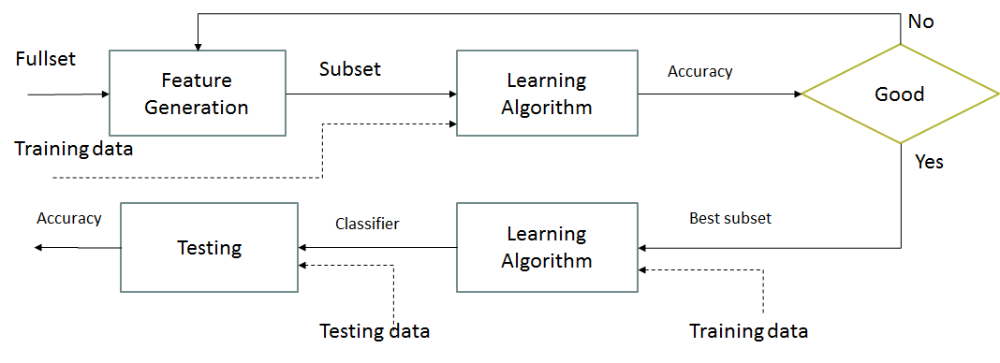

```{r setup,, echo=FALSE}

knitr::opts_chunk$set(echo = FALSE,root.dir="C:/Master/apuntes-articulo-feature-selection/",fig.pos = 'H')

#setwd("C:/Master/apuntes-articulo-feature-selection/")
```


# [Feature selection](#feature-selection)

This section describes the process that we perform to reduce the dimension of the sleep hygiene data set  that contains the features to model the quality of sleep for respondents of the survey described in chapter \@ref(data-adquisition). There exist two ways to addressed dimensionality reduction, feature extraction and feature selection. Feature extraction, consists in generate a new and small feature space. The application of a technique of feature extraction produce new features based in original ones. The new dataset is not understandable in terms of the original dataset, rather, it is an abstraction of this and its visualization have no practical meaning. On the other hand, feature selection choose a small subset of the relevant features from the original dataset according to certain relevance evaluation criterion, which usually leads to better learning performance, lower computational cost, and better model interpretability [@Tang2014]. 

For the purposes of this study, the technique of selection of characteristics is the most appropriate. Our interest in reducing dimensionality is not related to the decrease in computational cost, rather, the purpose is to decrease the number of predictive variables due to the high cost of design and infrastructure that means capturing 21 different signals through sensors. If it is possible to characterize a high percentage of the phenomenon, through a reduced number of factors of sleep hygiene, the design of the system will be more feasible and less expensive.

The model accuracy for prediction of the sleep quality with the subset of features must be better than the training model using the total of sleep hygiene features.  

## [Feature selection models](#feature-selection-model)
In 1996, [@Liu1998] proposes two models to achieve the reduction of features, that have been used as basis of diverse algorithms still in force. The filter model (see Figure \@ref(fig:filter-model)) that uses as criterion of feature selection, some attributes concerning only to the data domain. Especifiacally in this model, Liu et. al. proposes that it is posible to analyze and make decisions over irrelevance or relevance of features based in measure information gain, dependence, distance and consistency.

```{r filter-model, fig.cap='Filter model proposed by Liu et. al.', out.width='60%', fig.asp=.75, fig.align='center', echo=FALSE}
knitr::include_graphics("images/filter-model.png")

```

The second model showed in Fig. \@ref(fig:wrapper-model) proposed is the wrapper model that uses the accuracy of prediction as selection criterion, it means that this techniques are committed with a particular classifier in this stage of the learning process. 

```{r wrapper-model, fig.cap='Wrapper model proposed by Liu et. al.', out.width='60%', fig.asp=.75, fig.align='center', echo=FALSE}


```

Both models have advanteges and disadvantages, techniques based in filter model, performs better than others based in wrapper model, however, researchers have no idea over prediction accuracy during the feature selection process. Some practitioners don't preffer to use these techniques because if accuracy prediction is not achieved in the proposed level, the first steep can be regarded as a waste of time. On the other hand, some researchers argued that select features based in determinated classifier, reduces the possibility to use other classifier to generate the prediction model, in this sense, the classifier to generate the final model should be choosed at the begining, and it is not convenient for all problems. In these order of thinks, [@Kelleher2015] comment that wrapper models are more computationally expensive than filters models and that the argument of they are uncertain models respect to the accuracy, is not at all valid since filters model often generate models with good accuracy.

Additionaly, [@Liu1998] highlight *Search*, *Scheme*  and *measure* as three important concepts that help to decide what technique is the most appropriate for an specific problem of dimentionality reduction by feature selection (see Fig. \@ref(fig:main-dimensions-dr)). Search refers to the activity of choose features in non deterministic, heuristic or complete form, Scheme must be determine if the search will be forward, backward or in random mode, and, measure has to do with tree ways to establish the threshold for stopping the feature search, the criterion used are accuracy, consistency, and, classic criterion involving distance, information gain and dependence. 


```{r main-dimensions-dr, fig.cap='Main dimensions in feature selection, Liu et. al.', out.width='60%', fig.asp=.75, fig.align='center', echo=FALSE}
knitr::include_graphics("images/main-dimensions-in-feature-selection.png")

```

A third type of model has been proposed in last years, these models are called **embedded models**, since they allow practitoners select features while the prediction model is built. Embedded models have the advantage of filters model in terms of low computational cost, and take the advantage of wrapper model, because the prediction accuracy and classification model are involved in the process. [@Tang2014] describe three type of embedded methods as we shows in the Table \@ref(tab:table-embedded-methods).

\begin{table}[h]
\centering
\caption{Embedded methods as \cite{Tang2014} describes and quoted verbatim in his paper.}
\label{tab:table-embedded-methods}
\begin{tabular}{|>{\centering\arraybackslash}p{3cm}|>{\arraybackslash}p{10cm}|>{\centering\arraybackslash}p{2cm}|}
\hline Method & Description & Cite \\ 
\hline Pruning & Utilizing all features to train a model and then attemp to eliminate some features by setting the corresponding coefficients to 0, while maintaining model performance such as recursive feature elimination using support vector machines (SVM) & \cite{Guyon2002} \\ 
\hline Build-in & Mechanism for feature selection as ID3 and C4.5 & \cite{Quinlan1986,Quinlan1993} \\ 
\hline Regularization & Utilices objective functions that minimize fitting errors and in the mean time force the coefficients to be small or ti be exact zero. & \cite{Ma2008} \\ 
\hline 
\end{tabular} 
\end{table}

These models are representative of the theoretical basis where a lot of algorithms for selection features in last twenty years have been fueled. Likewise four concepts are the most important and have been used for the generation of different feature selection algorithms in last two decades: distance, accuracy, inconsistency and information gain.

- Distance: The main goal to use distance, is to find similarity among instances in a dataset. The Equation proposed by Minkowski (see \@ref(eq:Minkowsky)) is a generalization of the distances that are used in MLA. The most common distances are the particular cases where $p=1$ called Manhatan distance (see Eq. \@ref(eq:Manhattan)) and where $p=2$, the well known Euclidian distance (see Eq. \@ref(eq:Euclidean)). (All three equations were taken from [@Kelleher])


\begin{equation}
      Euclidean(A,B)=\sqrt{(a_1-b_1)^2+(a_2-b_1)^2+\dots+(a_n-b_n)^2}
      (\#eq:Euclidean)
\end{equation}


\begin{equation}
      Manhattan(a,b)=\sum_{i=1}^{m}abs(a[i]-b[i])
      (\#eq:Manhattan)
\end{equation}

\begin{equation}
    Minkowski(a,b)=\left({\sum_{i=1}^{m}abs(a[i]-b[i])^p}\right)^{\frac{1}{p}}
    (\#eq:Minkowski)
\end{equation}

The implication of use different values of $p$ will be noted in the difference between two values of any feature in the final distance, it is directly proportional to the value of $p$. It means that large differences between two features in an instance, impact stronger in the final result when $p$ grows.


- Accuracy: Accuracy refers to the successes that a model had to predict each instance of a dataset, it is opposed to the miscalssification error as [@Kelleher2015] defines in \@ref(eq:math-misclassification-rate) and \@ref(eq:math-accuracy) equations.


\begin{equation}
  misclassification\ rate=\frac{(FP+FN)}{(TP+TN+FP+FN)}
  (\#eq:math-misclassification-rate)
\end{equation}

\begin{equation}
  accuracy=\frac{(TP+TN)}{(TP+TN+FP+FN)}
  (\#eq:math-accuracy)
\end{equation}

