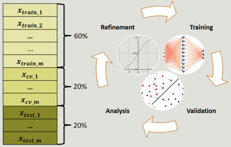
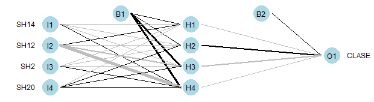
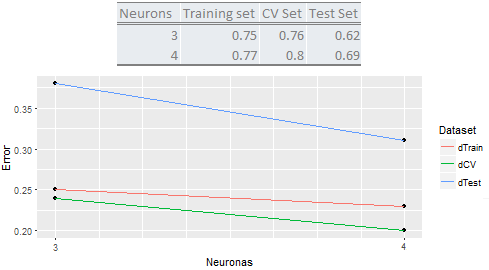

```{r setup,, echo=FALSE}

knitr::opts_chunk$set(echo = FALSE,root.dir="C:/Master/apuntes-articulo-feature-selection/",fig.pos = 'H')

#setwd("C:/Master/apuntes-articulo-feature-selection/")
```

# [Evaluation of Efficiency](#efficiency-evaluation)


Before testing the selected factors, models were trained using the 21 sleep hygiene factors to know the predictive efficiency that these models from various techniques of machine learning could achieve. The result was that both, the support vector machines (SVM) with linear kernel and logistic regression, were the two techniques with the best results. The SVM algorithm had an efficiency of 67% and the logistic regression reached an efficiency of 70%. With this background, the tests described below were made, taking into account only the four selected factors. If any of the techniques reaches an efficiency equal to or higher than the previous results, the selection of variables can be considered a successful process and these factors will be used for the prediction model of the study hereafter.

One of the steps in the development of the investigation project, includes the selection of a technique to train a predictive model on supervised automated learning. We did a review of the literature and we select three techniques under certain criterion based in the nature of the problem. The purpose is train the model with the available data and select the one given the best prediction. So, at the same time that the evaluation of efficience of the selected factors was performed, the selection of the technique that will be used for the final training was done. The three techniques that meet the inclusion criteria, were: artificial neural networks, vector supported machines And logistic regression with regularization. As in feature selection, a Shiny application was developed to process the data and compare the outcomes for these three algorithms, training a model with total of the records and only the four features selected in the feature selection process as was explained in Section \@ref(feature-selection). 

The evaluation was performed by the cross validation technique using an iteration process of training, validation, analysis and refinement as the figure \@ref(fig:cross-validation-process) shows. In this process a sixty percent of the data was used to train the model, when training conclude, the cross validation is performed through the prediction of the target variable in the cross validation set, containing a twenty percent of the main dataset. The analysis is done at that time and depending on the results, the parameters are adjusted to make a new iteration or reach the stop point. If the stop point was reached, the model is proved in the test set to obtain the final efficience of the model.

```{r cross-validation-process, fig.cap='Cross Validation Process', out.width='80%', fig.asp=.75, fig.align='center', echo=FALSE}


```

## [Neural Networks Results](#neural-networks-results)

Two neural networks were trained and validated by cross validation process, both estructures with a hidden layer. The first neural network had three neurons in the hidden layer and the second four neurons. The Fig. \@ref(fig:nn-four-neurons) shows the structure of the neural network with four neurons in the input layer, one neuron for each factor selected in the feature selection process. The second layer is the hidden layer with four neurons and the last layer contains one neuron for the result (good sleep quality/bad sleep quality). Additionaly it is possible to observe the two activation neurons in the top of the figure.

```{r nn-four-neurons, fig.cap='Structure of neural network with four neurons in the hidden layer', out.width='80%', fig.asp=.75, fig.align='center', echo=FALSE}


```

The results for the two neural networks and the appropriate comparison are presented in the Fig. \@ref(fig:results-of-the-3-4-nn). The network with better efficiency of two networks is the network with four neurons. The table describes that in the three sets, the behavior was superior in terms of efficiency, while the plot represents the error per each set with three and four neurons. CClearly, the lines decrease in favor of the training and validation with four neurons, where the error of the prediction is smaller. 

```{r results-of-the-3-4-nn, fig.cap='Comparison of the results for the two trained neural networks', out.width='80%', fig.asp=.75, fig.align='center', echo=FALSE}


```


