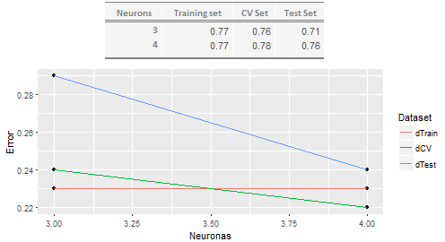
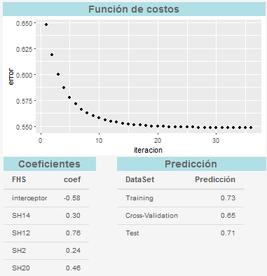

```{r setup-efficiency, echo=FALSE}

knitr::opts_chunk$set(echo = FALSE,root.dir="C:/Master/apuntes-articulo-feature-selection/",fig.pos = 'H')

#setwd("C:/Master/apuntes-articulo-feature-selection/")
```

# [Evaluation of Efficiency](#efficiency-evaluation)


Before testing the selected factors, models were trained using the 21 sleep hygiene factors to know the predictive efficiency that these models from various techniques of machine learning could achieve. The result was that both, the support vector machines (SVM) with linear kernel and logistic regression, were the two techniques with the best results. The SVM algorithm had an efficiency of 67% and the logistic regression reached an efficiency of 70%. With this background, the tests described below were made, taking into account only the four selected factors. If any of the techniques reaches an efficiency equal to or higher than the previous results, the selection of variables can be considered a successful process and these factors will be used for the prediction model of the study hereafter.

One of the steps in the development of the investigation project, includes the selection of a technique to train a predictive model on supervised automated learning. We did a review of the literature and we select three techniques under certain criterion based in the nature of the problem. The purpose is train the model with the available data and select the one given the best prediction. So, at the same time that the evaluation of efficience of the selected factors was performed, the selection of the technique that will be used for the final training was done. The three techniques that meet the inclusion criteria, were: artificial neural networks, vector supported machines And logistic regression with regularization. As in feature selection, a Shiny application was developed to process the data and compare the outcomes for these three algorithms, training a model with total of the records and only the four features selected in the feature selection process as was explained in Section \@ref(feature-selection). 

The evaluation was performed by the cross validation technique using an iteration process of training, validation, analysis and refinement as the figure \@ref(fig:cross-validation-process) shows. In this process a sixty percent of the data was used to train the model, when training conclude, the cross validation is performed through the prediction of the target variable in the cross validation set, containing a twenty percent of the main dataset. The analysis is done at that time and depending on the results, the parameters are adjusted to make a new iteration or reach the stop point. If the stop point was reached, the model is proved in the test set to obtain the final efficience of the model.

```{r cross-validation-process, fig.cap='Cross Validation Process', out.width='80%', fig.asp=.75, fig.align='center', echo=FALSE}
knitr::include_graphics("images/cross-validation-process.png")

```

## [Neural Networks Results](#NN-results)

Two neural networks were trained and validated by cross validation process, both estructures with a hidden layer. The first neural network had three neurons in the hidden layer and the second four neurons. The Fig. \@ref(fig:nn-four-neurons) shows the structure of the neural network with four neurons in the input layer, one neuron for each factor selected in the feature selection process. The second layer is the hidden layer with four neurons and the last layer contains one neuron for the result (good sleep quality/bad sleep quality). Additionaly it is possible to observe the two activation neurons in the top of the figure.

```{r nn-four-neurons, fig.cap='Structure of neural network with four neurons in the hidden layer', out.width='80%', fig.asp=.75, fig.align='center', echo=FALSE}


```

The results for the two neural networks and the appropriate comparison between them, are in the Fig. \@ref(fig:results-of-the-3-4-nn). The network with better efficiency of two networks is the network with four neurons. The table describes that in the three sets, the behavior was superior in terms of efficiency, while the plot represents the error per each set with three and four neurons. CClearly, the lines decrease in favor of the training and validation with four neurons, where the error of the prediction is smaller. 

```{r results-of-the-3-4-nn, fig.cap='Comparison of the results for the two trained neural networks', out.width='80%', fig.asp=.75, fig.align='center', echo=FALSE}


```

The results of the neural network, satisfy the conditions sought, because although it is not greatly improved in efficiency when compared to what can be obtained by employing all the factors of sleep hygiene, we gain in the amount of factors that must be sensed to obtain input data. This fact has great relevance for the project because it greatly limits the design and infrastructure of the data acquisition module.

## [Logistic Regression Results](#LR-results)

We train the model through logistic regression (LR) with regularization parameter and polynomials of degree one, two and three, in order to look for the optimal point between over fit and bias. The regularization parameter based on the norm $l_2$ takes the form of the equation \@ref(eq:regularization-parameter), where $\lambda$ took values from 0.1 to 0.6 with intervals of 0.03 to choose the optimal value.

\begin{equation}
  reg=\frac{\lambda}{2m}\sum_{j=2}^{n}\theta_j^2
  (\#eq:regularization-parameter)
\end{equation}

The stop condition for the adjustment of the parameters of the regression is of the order of one hundred thousandths, that is to say, while the previous and the current cost function did not have a difference of 0.00003 between both, the regression continued to iterate. 

The results of LR's are shown by the application in the format of the Fig. \@ref(fig:lr-poly-1). This figure shows the original results for the LR with the polynomial of degree one, we obtained five coeficients including the intercept coeficient, the right table have the data of prediction, $70\%$ of efficiency for the training set, $76\%$ for the cross validation set and $69\%$ in the test set. The plot in the top of figure, shows the behavior of the cost funtion through the iterations in the compute and refinement of the parameters. 


```{r lr-poly-1, fig.cap='Results of the LR and polynomial grade one', out.width='80%', fig.asp=.75, fig.align='center', echo=FALSE}


```


For polynomials of degree two and three we have a similar figure, the difference is the number of coeficients that in the case of the polynomial of degree two are 16 and, in the polynomial of grade three are 35, including in both cases *dummy factors*. In the case of polynomial of degree two the cost function iterated 150 times and the predictions were $72\%$ of efficiency for the training set, $78\%$ for the cross validation set and $69\%$ for the test set. The LR with the polynomial of degree three, did 446 iterations, having a precision in the prediction of $75\%$ for the training set, $70\%$ for the cross validation set, falling to $62\%$ for the test set. 

<!-- table:tab: -->
<!-- |                      | degree 1 | degree 2 | degree 3 | -->
<!-- |----------------------|----------|----------|----------| -->
<!-- | training set         | 70 %     | 72 %     | 75 %     | -->
<!-- | cross validation set | 76 %     | 78 %     | 70 %     | -->
<!-- | test set             | 69 %     | 69 %     | 62 %     | -->

\begin{table}[ht]
\centering
\caption{Comparison of efficiency of LR with polynomials of degree one, two and three}
\label{tab:results-of-efficiency-logistic-regression}
\begin{tabular}{llll}
\hline
                     & degree 1 & degree 2 & degree 3 \\ \hline
training set         & 70 \%    & 72 \%    & 75 \%    \\
cross validation set & 76 \%    & 78 \%    & 70 \%    \\
test set             & 69 \%    & 69 \%    & 62 \%    \\ \hline
\end{tabular}
\end{table}

Comparing the three results in the table \@ref(tab:results-of-efficiency-logistic-regression), we conclude that the polynomial of degree one is the best choice for this study, because, is the algorithm that consumes the lower resources of the processor and memory and have similar predictions than the other two models of degree two and three. Results, also are satisfactory if they are compared with the results using the 21 input data.

## [Supprot Vector Machine Results](#SVM-results)

As in the previous algorithms, for support vector machines algorithm, a cross valitation test was performed. In this case, were used four kernels, two lineal kernels with polynomials of degree one and two, one radial kernel and one sigmoide kernel. The Fig. \@ref(fig:SVM-sigmoide-2-flecha) shows the results as they are presnted in the Shinny application, we can see in the left panel, the plot showing diferents values of C and Gamma parameters and how is the behavior of the error depending of these two parameters. In the right side we observe that the best values for C is 0.04 and the best value for Gamma is 0.5 to reach the best prediction for this kernel, 76\% of prediction in the test set.


```{r SVM-sigmoide-2-flecha, fig.cap='Results of SVM with sigmoide kernel', out.width='80%', fig.asp=.75, fig.align='center', echo=FALSE}


```


The Table \@ref(tab:results-of-efficiency-svm) show a comparative framework of results of the four kernels that were tested. We can observe that the sigmoid and radial are the best evaluated with a slight advantage of 3 percentage points of the sigmoid over the radial. The linear kernel is not a bad choice if one thinks in terms of simplicity to program it and the little memory and processor that consumes.

\begin{table}[ht]
\centering
\caption{Results of officiency in prediction with SVM algorithm}
\label{tab:results-of-efficiency-svm}
\begin{tabular}{lllll}
\hline
                         & Lineal degree one & Lineal degree two & Radial & Sigmoide \\ \hline
Training dataset         & 72 \%             & 69 \%             & 80 \%  & 74 \%    \\
Cross Validation dataset & 70 \%             & 78 \%             & 69 \%  & 59 \%    \\
Test dataset             & 71 \%             & 67 \%             & 73 \%  & 76 \%    \\
Parameter C              & 0.04              & 0.14              & 0.40   & 0.04     \\
Parameter Gamma          & 0.5               & 0.5               & 0.5    & 0.5      \\ \hline
\end{tabular}
\end{table}

The table also present the best C and Gamma parameters that the cross validation process selected for these algorithms, the parameter Gamma maitains its value in each one of the two kernels that is required (radial and sigmoide), 0.5 is the best value of the six values tested. On the other hand, the parameter C, shows that small values are more appropriate than big values. In this case C work in a range of 0.01 to 1000. It means that the gap between two levels of classifications is large as possible.


